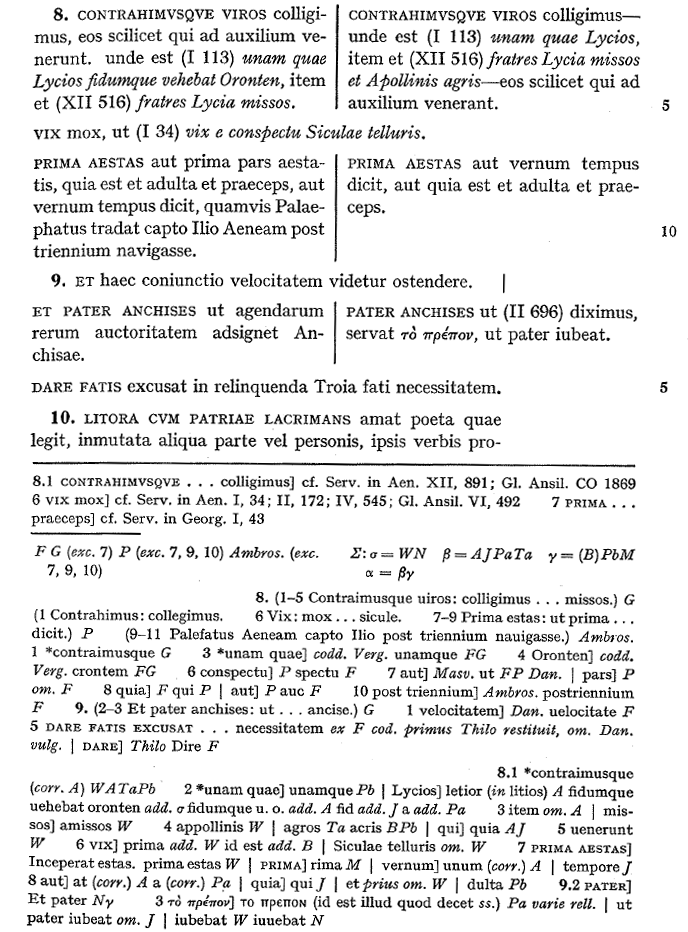
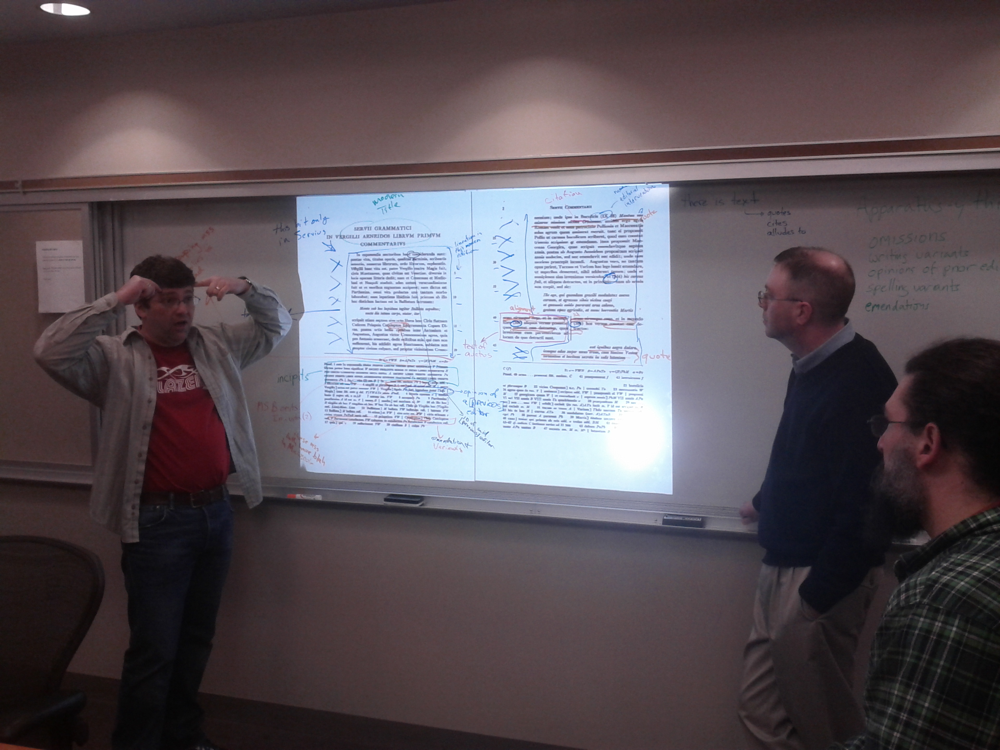
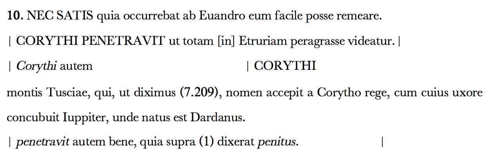
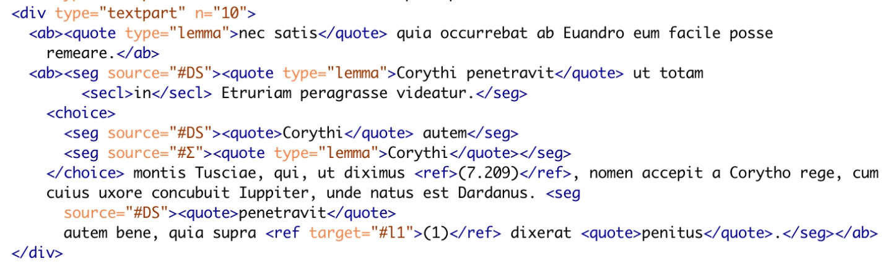
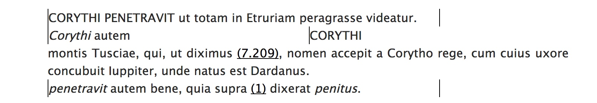
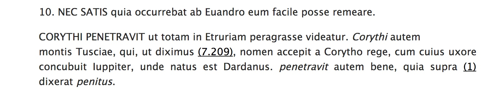
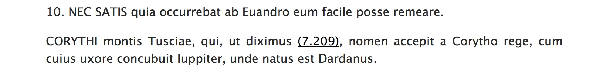
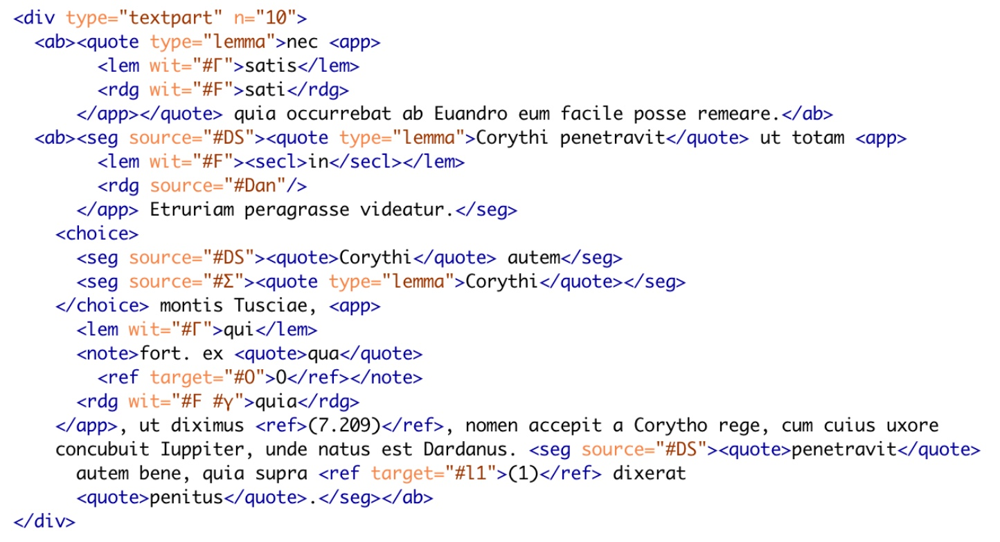
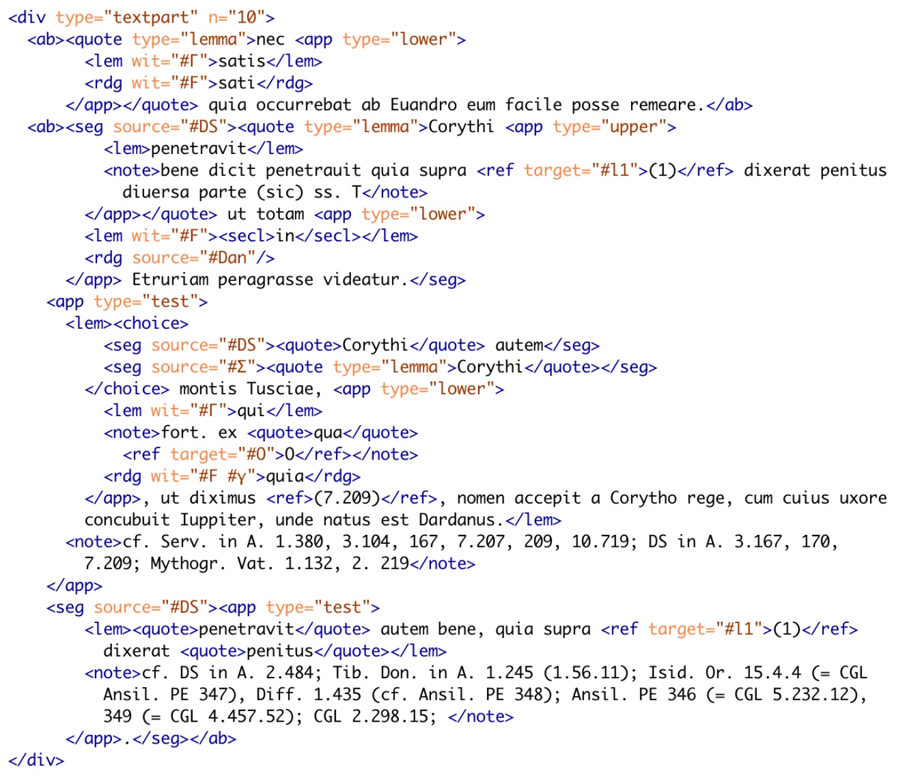

# Digital Servius
## Hugh Cayless, DC3

The paper linked below is the text of what should have been the paper I delivered at the 2018 AIA/SCS annual meeting. Unfortunately, the conference's start date coincided with the arrival of the "bomb cyclone" nicknamed Grayson in Boston, which curtailed pretty much all travel up the Eastern seaboard of the United States. It sounds like it was a fantastic meeting, and I was very sorry to miss it.

The paper was written for delivery to an audience of Classicists who know little about TEI, but I think it will be accessible to anyone with a bit of background. So an introduction is in order. The panel was titled "New Age Servius". Who was Servius, and why should you care? [Maurus Servius Honoratus](https://www.britannica.com/biography/Servius) was a 4th/5th century grammarian, an ancient scholar, who wrote a commentary on the works of Vergil. So he's interesting as an example of ancient scholarship, and also because his commentary preserves lots of knowledge about Roman religion, history, culture and language, as well as quotes from otherwise lost works. The commentary is also interesting because we have it in two distinct versions, the shorter version of Servius and a longer version which compiles Servius's entries with others, many from another commentary, which may be the one by [Aelius Donatus](https://www.britannica.com/biography/Aelius-Donatus), otherwise lost. The medieval compiler has done more than just mash these texts together: stylistic alterations have been made to make the new text flow better, and some of Servius's entries have been trimmed. The longer version is known as Servius Auctus or Servius Danielis (Daniel's Servius) from Pierre Daniel, who first published it in 1600. In the paper, I refer to the shorter version as "Servius" and the longer as "DS". Since this was meant for oral delivery, I thought there would be less chance of confusing both myself and the audience by maintaining a strong aural distinction between the two.

The history of editions of Servius is a bit fraught. The only complete edition is Thilo's ([vol. 1 from Archive.org](https://archive.org/stream/serviigrammatici01bons#page/4/mode/2up)) from the 19th century. It combines the two texts into a single one, indicating with italics where text comes only from DS. Combining the texts in this way can't help but do some violence to both, however. The series commonly known as the "Harvard Servius", begun by E. K. Rand, who published volume 2 (Aeneid 1-2) in 1946, and continued by A. F. Stocker and A. T. Travis with volume 3 (Aeneid 3–5), 1965, attempted to represent both, but to format the texts in such a way that it was easy to tell what text belongs to DS and what to Servius. P. K. Marshall worked on volume 4 (Aeneid 6–8), and C. E. Murgia on volume 5 (Aeneid 9–12). Sadly, neither lived to see the work to its conclusion. Robert Kaster collected Murgia's papers and has completed work on assembling them into a publishable text. This is the work my paper refers to. James Brusuelas, who was also to present on the canceled panel, is working with Marshall's text of the commentary to Aeneid 6.

The Harvard Servius presents the text full-width on the page where Servius and DS agree, prints DS-only text 3/4-width and flush left, Servius-only text 3/4-width and indented 1/4, and where both have text but it doesn't agree, it is printed in 2 columns, DS on the left and Servius on the right. So Servius is interesting from a technical perspective too. Figuring out the best way to mark it up is challenging and likewise figuring out how best to render it.

 An example page from volume 3 of the Harvard Servius

To accompany the paper, I worked up some demos. The [first](servius.html) shows a snippet of Murgia-Kaster's Servius from the beginning of book 9, the [second](servius-S.html) and [third](servius-DS.html) show how easy it is to produce either Servius-only or DS-only versions of the text. Only the CSS and a little bit of Javascript are different in the three views. All 3 are generated on the fly in your browser from a single XML source using [CETEIcean](https://github.com/TEIC/CETEIcean) plus some extra Javascript. None of this should be regarded as final. There are still features of Murgia-Kaster that I haven't decided how to represent, and other aspects of the markup that have yet to be finalized.

## Modeling Servius for the Digital Latin Library - Cayless - Boston 2018

It took me a long time to find what I hope is the right framing for this paper. I want to present a quite technical topic: how the Digital Latin Library (http://digitallatin.org/) plans to deal with the forthcoming fifth volume of the “Harvard Servius”—a subject which isn't directly Classical—to an audience of Classics scholars without boring them to tears (or sleep) on a Saturday morning. In the end, I realized that what this really wants to be is a meditation on constraints: the constraints imposed on us both by the media we work in and by the choices we make. As I’m sure you know, Bob Kaster has been working on the completion of the material Murgia had developed for volume five before his death, and the work outlined here is based on a near-complete version of that edition.

Murgia notes in the preface to volume five that he is working within a tradition, and therefore followed conventions that he probably wouldn't have adopted had he been starting from scratch.

> The editor of the first volume in a series or of a complete work would have as his task the creation of an edition which accorded in all respects with the form he considered ideal. He would decide without prejudice whether a two-column format was desirable and, if so, whether Servius or Servius Auctus belonged in the left column; he would choose his conventions for orthography, punctuation, citations of testimonia, and much else based simply on the standards which he himself considered appropriate. The editor of the fifth volume of a series cannot enjoy such freedom. If he is not to befuddle the reader unnecessarily he must depart from conventions of preceding volumes only when strong reasons compel, and only to the extent needed to provide a good edition.

He points out the ways in which the Harvard Servius’s format was an attempt to remedy one of the important deficiencies of Thilo’s edition, namely that it tends to elide the differences between Servius and Servius Auctus (DS), hiding the fact that DS isn’t just Servius plus extras. But he goes on to detail the ways in which the improved formatting choices also carried with them their own problems. The choice in volume two to make DS the “primary” text, placing it in the left hand column and relegating minor differences to the apparatus means that the reading of Servius doesn’t always appear in the text. Volume three attempted to correct this by splitting the page for minor differences, but even so, DS remains the first text encountered by the reader and the formatting “makes uncommon demands on the attention of the reader,” because it is not clear at the beginning of a line whether it represents the agreement of Servius and DS, or just DS. Murgia’s edition attempts to correct this issue by always wrapping DS’s text in vertical lines.

The DLL was faced with a double problem when deciding how to deal digitally with its editions: not only did we have to decide how they should look, and what functions they might have that cannot be accommodated by print, but also we had to decide on a format, a data model, for the sources. By “data model” I mean the internal representation of the information in a document, which, to a large extent, dictates what can be done with it. Both of these represent constraints, in much the same way that editorial policies do. The first of these decisions was in some ways easy to make: just as Murgia did not feel he could overthrow prior presentational conventions in the midst of a series, we did not think it sensible to depart too far from general editorial conventions for critical editions. Our editions would each have a critical apparatus, a preface, a table of  sigla, etc., and would look, mutatis mutandis, quite familiar to a user of print editions.

The “back end” format was more of an open question. During one of the early planning meetings for the DLL project, in an attempt to enumerate all of the features one might wish to encode in a digital edition, we projected a page from the Harvard Servius onto a whiteboard and used markers to annotate all of the places where there was useful information implicit in the formatting and typography. We chose Servius of course, because of its complex use of print conventions to model the information in an edition. Our early discussions focused on apparatus as a set of annotations on the main text. Given my background, I was convinced that the Text Encoding Initiative would provide a good answer to our questions about format (full disclosure: I have been for the last three years the Chair of the Technical Council of the TEI, and have been a user of it for going on twenty years). But it is not the only game in town for digital editions.

 Some of the DLL cabal (Tom Elliott, Sam Huskey, and Josh Sosin)

There is a lot of work going on in the area of automated collation, where you start with transcriptions of the sources and use software to aid in the creation of editions therefrom. It has been argued in recent years that textual variation is best represented as a directed graph, using which any desired version of the text might be constructed by choosing different paths through the graph. Certainly it would be nice to have available transcriptions of all (or at least all useful) sources for a text. Images of those sources would be nice to have as well. At the TEI Annual Meeting in November, a medievalist who works on digital editions asserted that any edition without these is “crap”. Clearly there are a lot of potential choices. But in the end, we were guided by the constraints we set ourselves. Our understanding of critical editions is as an editor’s argument about a text, not as a sort of “Choose Your Own Adventure” book. The latter puts too much pressure on a non-expert reader, who just wants a good version of the text to read, but might be inspired to look into the tradition behind it. Ideally, that reader would be able to choose to read the text without consulting the apparatus, or could use the apparatus, and could dig as far into the digitized sources behind it as possible online.

TEI provides a good framework for doing this sort of thing. And again, constraints become important. A TEI document is a Unicode text document that uses tags—elements wrapped in angle brackets to mark and delimit features of the text that the editor considers important. These elements do things like distinguish metadata from text, mark the internal structures of the text (such as chapters, paragraphs, or verse lines), features of the source in transcriptions, and the location and shape of textual variance. Elements can have attributes, which are name/value pairs that serve to refine the semantics of elements or to provide additional metadata for them. One does not simply choose to use TEI: the Guidelines cover many types of text, not just critical editions, so it is necessary to constrain them to a usable subset. Fortunately, we have a longstanding example of how to do critical editions (albeit of a somewhat different flavor) using TEI in EpiDoc. It didn’t hurt us that we had Tom Elliott, the founder of EpiDoc on the DLL team. TEI XML employs a system called ODD (for One Document Does it all) to document subsets, and from this source, both documentation and schemas that can be used to check the conformance of an edition can be generated. The DLL Guidelines and schemas are generated from just such an ODD, which is itself based on the one published by EpiDoc.

Now I’m going to terrify you with angle brackets. 9.10 has:

 figure 1

This one is messy. Let me walk you though it. There are two lemmata for line 10. The first occurs in both Servius and DS and so is left aligned in the print version. In the second, DS has a fuller entry with a sentence not in Servius at the beginning and continues with what is, in Servius, the lemma CORYTHI, and then the rest of the entry, which both have in common. This entry does indeed show how DS changes the text of Servius. It makes clear that in the latter, the entry starts with what is the second appearance of Corythi in DS, and that the Compiler (as Murgia refers to him) has added the connector autem to join Servius’s entry to another. But the formatting also does some real violence to the flow of the entry. The need to juxtapose the parallel segments of the entry in Servius and DS requires that those segments appear side-by-side on their own line, breaking the entry up. The print edition achieves clarity about its sources at the expense of the reader’s cognitive load. The quoted section above shows how the Compiler worked to merge multiple sources into a seamless flow, but does it precisely by interrupting that flow.

 figure 2

The second figure above illustrates a straightforward conversion of Murgia-Kaster into TEI XML. An entry for a line is marked as a 
, and within that, each sub-entry is marked with an <ab>. Where a section of text needs to be identified as belonging to Servius or DS, it has a “source” attribute on it. That attribute points at a definition elsewhere in the document. Segments of text below the level of a sub-entry are marked with <seg> tags, and where those are placed in parallel, the <choice> element wraps them. Lemmas are <quote>s, with a type attribute marking them as lemmas. Other quoted text is wrapped in simple <quote>s, and references tagged with <ref>. TEI allows us to link these quotes and references to their sources using attributes, just like the source attribute identifies which tradition a piece of text belongs to.

The first question to ask about our tagging is whether it can be used to reproduce the formatting and style of the prospective print edition. And the answer is that it can. <seg source="#DS"> can be wrapped in vertical lines, parallel <seg>s inside a <choice> can be displayed on the same line, lemmas can be capitalized, and so on. We can even go further: since we know when pieces of text come from Servius or DS alone, we can actually generate a view that is just Servius or just DS, or even do both and put them side-by-side—up to a point, anyway. We can only do this where the differences are marked.

 DS and Servius (DLL web presentation)

 DS with Servius filtered out

 Servius with DS filtered out

Can the digital edition do any better? The answer is that it depends how far we are willing to go in re-working the source material. If we had completely distinct editions of Servius and DS which were aligned, then we could do a lot of the same sorts of display, though it would be quite hard to derive something like the edition Murgia produced. A full side-by-side Servius and DS would make it crystal clear how the two traditions are related, and various digital tools could be deployed to highlight the similarities and differences. The removal of the constraints of print (which would make roughly doubling the size of the volume a problem) would permit a deeper understanding of both. Again, we’re pushing up against the constraints we’ve set ourselves. If the edition must be a singular text, then we can generate multiple views of it, but we probably can’t perfectly disentangle Servius from DS. But If we started with multiple sources, we probably couldn’t achieve what Murgia took as his starting point—an output that works like the previous volumes in the series.

Servius is a text that demands multiple views. What we have in print is a single view that is a compromise. Different compromises have been made in presenting Servius in print, but no single view can be completely satisfactory. Broadly speaking, editors have followed two approaches in presenting the text of Servius: Thilo, and more recently Ramires, opted for a completely unified text, using typographical conventions like italics, bold type, and spread text to distinguish Servius from DS. The Harvard Servius treats the differences between Servius and DS as more significant, and distinguishes them by their placement on the page, but still aims for a mostly unified text.

You may have noticed that we still haven’t gotten to the apparatuses. There are three in the Harvard volumes: one of testimonia, and then an upper and lower critical apparatus. In the earlier volumes, the upper critical apparatus was for DS, and the lower for Servius. Murgia’s Servius does away with this division, combining the variants of witnesses to both Servius and DS into the lower apparatus, which he has made a positive apparatus. The upper apparatus “now contains a record of the auxiliary witnesses” to DS. This move makes a lot of sense, because the main text of the edition attempts to display a mostly unified text and having a double apparatus means the reader has to decide where to look for critical notes.

The TEI Guidelines describe a few different methods for handling apparatuses. The DLL Guidelines employ the method called “parallel segmentation” in which textual variation is modeled inline, rather than in attached notes. This method makes for a denser source, but also permits the digital version to present an “active” critical apparatus, wherein variation is not just noted, but may actually be substituted in the text by the reader. The reader can become an active participant in understanding how the editor’s decisions have shaped the text, and how different decisions might lead to a different text. Figure 3 shows the TEI encoding for 9.10 with just the lower apparatus applied.

 figure 3

 figure 4

The addition of these <app>, <lem>, and <rdg> tags will allow the DLL’s text viewer to generate both a traditional-looking apparatus and a dynamic apparatus that permits the reader to test alternate readings. The viewer works by manipulating the TEI source’s data model, swapping the <lem> and the selected <rdg>, whereby the latter becomes visible in the text and the former is hidden. Figure 4 shows the same entry with all three apparatuses added. The upper apparatus and the testimonia are notes rather than variants. We now have to qualify each <app> with a type, so the viewer application will know where to put it and how to display it.

With the addition of this new layer of data, we can return to thinking about the problem of multiple views and the editorial and technical constraints within which we must work. It should be clear that Murgia’s unified critical apparatus adds another stumbling block in the way of disentangling Servius and DS because it ties the two together even more. With a separate apparatus for each tradition, we could easily have two texts, each with its own apparatus. Not so now.

Servius presents us with a particularly difficult text, one that stretches the bounds and capabilities of printed editions. We must take care that the constraints of its digital publication system do not damage it. One need only look at the online Perseus edition of Thilo to see what I mean: there is no distinction between the text of Servius and DS visible. If you download the source XML, you will see that in fact DS is marked, but it’s done in such a way that the Perseus publishing system doesn’t know what to do with it, and so flattens out the differences. I don’t point this out as a criticism of Perseus, without which we wouldn’t have a digital version of Servius at all, but rather to highlight a potential shortcoming of any large-scale digital publishing system. Servius is a bit of an extreme, but many critical editions have their own idiosyncrasies which must be accommodated or the publisher risks losing important information. For this reason, the DLL’s publishing system relies less on generic back end processing and more on customizable formatting and functionality in the browser. Servius makes it quite clear that digital editions require the flexibility to customize their models and presentation to accommodate the needs of the work at hand: a “one-size-fits-all” approach cannot succeed.

### References

Cayless, Hugh, “Critical Editions and the Data Model as Interface,” in *Digital Scholarly Editions as Interfaces*, Schriften des Instituts für Dokumentologie und Editorik. Forthcoming 2018.
Huskey, Samuel and Hugh Cayless, *Guidelines for Encoding Critical Editions for the Library of Digital Latin Texts*, 2017 <https://digitallatin.github.io/guidelines/LDLT-Guidelines.html>.
Elliott, Tom, Gabriel Bodard, Hugh Cayless et al., *EpiDoc: Epigraphic Documents in TEI XML*, 2006-2017, <http://epidoc.sf.net>.
Murgia, Charles E. “Why is the APA/Harvard Servius?: Editing Servius,” *Classical Papers*, 2004 <https://escholarship.org/uc/item/89p134jb>.
Murgia, Charles E. and Robert Kaster, *Servianorum in Vergilii carmina commentariorum editionis Harvardianae volumen V.*, Forthcoming.
The TEI Consortium, *TEI P5: Guidelines for Electronic Text Encoding and Interchange*, version 3.2.0, 2017 <http://www.tei-c.org/release/doc/tei-p5-doc/en/html/index.html>
